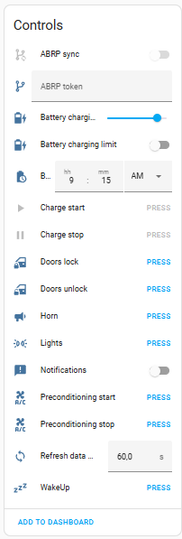
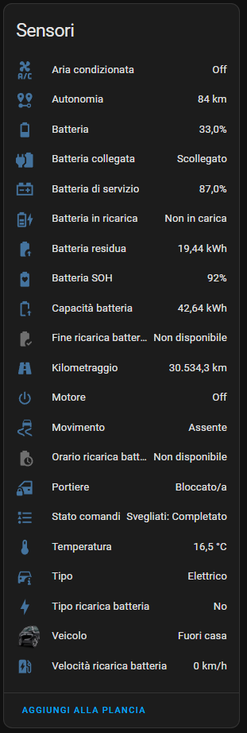

# HomeAssistant - Stellantis Vehicles
## Requisite
- **Vehicle native mobile app** installed and active;
- **Remote service** compatible vehicle;
- **Use a pc for installation**;

Currently only PSA vehicles are compatibile (Peugeot, Citroen, DS, Opel and Vauxhall).

Currently Stellantis not provide B2C api credentials, this integration use the mobile apps api credentials and login flow.

**Inspired by https://github.com/flobz/psa_car_controller (OTP step its a fork).**

## Features
- Get vehicles status;
- Send remote command;
### Only EV
- Set charging limit;
- Sync data with **ABRP - A Better Routeplanner**;

## Installation
<details><summary><b>Using HACS</b></summary>

1. Go to [HACS](https://hacs.xyz/) section;
2. From the 3 dots menu (top right) click on **Add custom repository**;
3. Add as **Integration** this url https://github.com/andreadegiovine/homeassistant-stellantis-vehicles;
4. Search and install **Stellantis Vehicles** from the HACS integration list;
5. Add this integration from the **Home Assistant** integrations.

</details>
<details><summary><b>Manually</b></summary>

1. Download this repository;
2. Copy the directory **custom_components/stellantis_vehicles** on your Home Assistant **config/custom_components/stellantis_vehicles**;
3. Restart HomeAssistant;
4. Add this integration from the **Home Assistant** integrations.

</details>

## Testing roadmap
### Vehicles
- [x] Opel Mokka-e 2022 [e-remote] (me)
- [x] Peugeot e208 2021 [e-remote] (@bgoncal, @Ladida1)
- [x] Vauxhall Mokka-e (@pantha007)
- [x] Citroen C5 X 2022 (@bycippy)
- [x] Opel Astra GSe 2023 (@xplore93)
- [ ] Others EV vehicles
- [ ] Others thermal vehicles
- [ ] Multi vehicles account
### Features
- [x] Command: **Charge Start/Stop** (E-remote)
- [x] Command: **Air conditioning Start/Stop** (E-remote)
- [x] Command: **Charge Start/Stop** (Connect Plus)
- [x] Command: **Air conditioning Start/Stop** (Connect Plus)
- [x] Command: **Doors** (Connect Plus)
- [x] Command: **Horn** (Connect Plus)
- [x] Command: **Lights** (Connect Plus)
- [ ] Sensor: **Battery capacity** accurance
- [ ] Sensor: **Battery residual** accurance
- [x] Sensor: **Doors** accurance
- [x] Sensor: **Engine** accurance
- [ ] Sensor: **Moving** accurance

Before any issue request please enable the debug log of this integration from your configuration.yaml:

```yaml
logger:
    default: error
    logs:
        custom_components.stellantis_vehicles: debug
```

and paste the log data on the issue request.

## Screenshot



## WakeUp
For some vehicles no updates are received a few minutes after the engine is turned off. Use automations like these to schedule the vehicle wake up:

```yaml
- id: "standby_wakeup"
  alias: Vehicle standby WakeUp (every 1 hour)
  description: ""
  mode: single
  triggers:
    - trigger: time_pattern
      hours: /1
  conditions:
    - condition: state
      entity_id: binary_sensor.#####VIN#####_battery_charging
      state: "off"
  actions:
    - action: button.press
      metadata: {}
      data: {}
      target:
        entity_id: button.#####VIN#####_wakeup
```

```yaml
- id: "charging_wakeup"
  alias: Vehicle charging WakeUp (every 5 minutes)
  description: ""
  mode: single
  triggers:
    - trigger: time_pattern
      minutes: /5
  conditions:
    - condition: state
      entity_id: binary_sensor.#####VIN#####_battery_charging
      state: "on"
  actions:
    - action: button.press
      metadata: {}
      data: {}
      target:
        entity_id: button.#####VIN#####_wakeup
```

**Some users report that performing too many wakeups drains the service battery, making some features unavailable (such as keyless entry).**

## Air conditioning Start/Stop
As described in the Stellantis apps, the command is enabled when:
1. the vehicle engine is off;
2. the vehicle doors are locked;
3. the battery level is at least 50% (20% for hybrids) or in charging.

## ABRP - A Better Routeplanner
Get a token from [ABRP](https://abetterrouteplanner.com/):
1. login to your account;
2. navigate to vehicle settings;
3. navigate to real time data;
4. navigate to edit connections;
5. generate a token using "Generic" method;

Use the generated token in **abrp_token sensor** and enable **abrp_sync switch** to send updates.

## Errors
### OTP error - NOK:MAXNBTOOLS
It seems that this error is due to reaching the limit of associated devices / SMS received. Restore your Stellantis account and try again:
[Follow this procedure from Peugeot community](https://peugeot.my-customerportal.com/peugeot/s/article/AP-I-have-problems-with-the-pin-safety-code-or-I-want-to-change-it-What-can-I-do?language=en_GB).

**<u>This operation removes the devices connected to your vehicle, no vehicle data will be lost.</u>**

## Translations
<details><summary><b>Pull request</b></summary>

Fork this repo and create/update your language file under `custom_components/stellantis_vehicles/translations/` starting from `en.json`.
</details>
<details><summary><b>Manually</b></summary>

Copy the content of file `custom_components/stellantis_vehicles/translations/en.json` to a new file, edit all labels ("key": **"Label"**) and open a issue request including the new/updated json language file.
</details>

## Support the project
[](https://www.buymeacoffee.com/andreatito)

[](https://ko-fi.com/andreatito)
