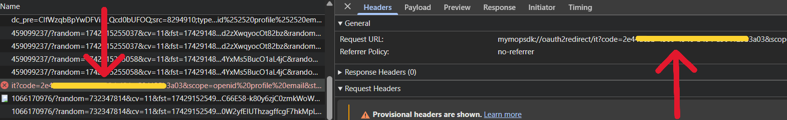

# HomeAssistant - Stellantis Vehicles
## Requisite
- **Vehicle native mobile app** installed and active;
- **Remote service** compatible vehicle;
- **Use a pc for installation**;

Currently only PSA vehicles are compatibile (Peugeot, Citroen, DS, Opel and Vauxhall).

Currently Stellantis not provide B2C api credentials, this integration use the mobile apps api credentials and login flow.

## Features

|                            | Electric / Hybrid | Thermic | E-remote control | Remote control  | Connect Plus |
|----------------------------|:-----------------:|:-------:|:----------------:|:---------------:|:------------:|
| Get status                 |        ✔️         |   ✔️    |        ✔️        |                 |      ✔️      |
| Wake up                    |        ✔️         |   ✔️    |        ✔️        |                 |      ✔️      |
| ABRP sync                  |        ✔️         |   ✔️    |        ✔️        |                 |      ✔️      |
| Preconditioning start/stop |        ✔️         |   ✔️    |        ✔️        |                 |      ✔️      |
| Doors open/close           |        ✔️         |   ✔️    |                  |       ✔️        |      ✔️      |
| Flash lights               |        ✔️         |   ✔️    |                  |       ✔️        |      ✔️      |
| Honk the horn              |        ✔️         |   ✔️    |                  |       ✔️        |      ✔️      |
| Charging start/stop        |        ✔️         |         |        ✔️        |                 |      ✔️      |
| Charging limit             |        ✔️         |         |        ✔️        |                 |      ✔️      |

## Installation
<details><summary><b>Using HACS</b></summary>

1. Go to [HACS](https://hacs.xyz/) section;
2. Search and install **Stellantis Vehicles** from the HACS integration list;
3. Add this integration from the **Home Assistant** integrations.

</details>
<details><summary><b>Manually</b></summary>

1. Download this repository;
2. Copy the directory **custom_components/stellantis_vehicles** on your Home Assistant **config/custom_components/stellantis_vehicles**;
3. Restart HomeAssistant;
4. Add this integration from the **Home Assistant** integrations.

</details>

## OAuth2 Code
<details><summary><b>Using browser console</b></summary>

As described on config flow, please get the right code from the mobile app redirect like this example (Chrome browser):



</details>
<details><summary><b>Using python tool</b></summary>

Thanks to [@benbox69](https://github.com/benbox69) for creating this awesome Python tool to fetch oauth code without using browser console: [stellantis-oauth-helper](https://github.com/benbox69/stellantis-oauth-helper)

</details>

## Screenshot


## Commands
### WakeUp
For some vehicles no updates are received a few minutes after the engine is turned off. Use automations like these to schedule the vehicle wake up:

```yaml
- id: "standby_wakeup"
  alias: Vehicle standby WakeUp (every 1 hour)
  description: ""
  mode: single
  triggers:
    - trigger: time_pattern
      hours: /1
  conditions:
    - condition: state
      entity_id: binary_sensor.#####VIN#####_battery_charging
      state: "off"
  actions:
    - action: button.press
      metadata: {}
      data: {}
      target:
        entity_id: button.#####VIN#####_wakeup
```

```yaml
- id: "charging_wakeup"
  alias: Vehicle charging WakeUp (every 5 minutes)
  description: ""
  mode: single
  triggers:
    - trigger: time_pattern
      minutes: /5
  conditions:
    - condition: state
      entity_id: binary_sensor.#####VIN#####_battery_charging
      state: "on"
  actions:
    - action: button.press
      metadata: {}
      data: {}
      target:
        entity_id: button.#####VIN#####_wakeup
```
\* the entity names above are in english, please use your language entity names.

**Some users report that performing too many wakeups drains the service battery, making some features unavailable (such as keyless entry).**

### Air conditioning Start/Stop
As described in the Stellantis apps, the command is enabled when:
1. the vehicle engine is off;
2. the vehicle doors are locked;
3. the battery level is at least 50% (20% for hybrids) or in charging.

### Air conditioning Start/Stop - Charge Start/Stop - Doors
These commands depend on the relative binary sensor, before send the opposite command please wait until the relative sensor state change.

## ABRP - A Better Routeplanner
Get a token from [ABRP](https://abetterrouteplanner.com/):
1. login to your account;
2. navigate to vehicle settings;
3. navigate to real time data;
4. navigate to edit connections;
5. generate a token using "Generic" method;

Use the generated token in **abrp_token sensor** and enable **abrp_sync switch** to send updates.

## Errors
Before any issue request, please check the integration log and look for solution below.

### OTP error - NOK:MAXNBTOOLS
It seems that this error is due to reaching the limit of associated devices / SMS received. Restore your Stellantis account and try again:
[Follow this procedure from Peugeot community](https://peugeot.my-customerportal.com/peugeot/s/article/AP-I-have-problems-with-the-pin-safety-code-or-I-want-to-change-it-What-can-I-do?language=en_GB).

**<u>This operation removes the devices connected to your vehicle, no vehicle data will be lost.</u>**

### OTP error - NOK:NOK_BLOCKED
It seems that this error is due to reaching the limit of wrong PIN used. Re-authenticate the integration.

## Translations
<details><summary><b>Pull request</b></summary>

Fork this repo and create/update your language file under `custom_components/stellantis_vehicles/translations/` starting from `en.json`.
</details>
<details><summary><b>Manually</b></summary>

Copy the content of file `custom_components/stellantis_vehicles/translations/en.json` to a new file, edit all labels ("key": **"Label"**) and open a issue request including the new/updated json language file.
</details>

## Contributors
Start from the "**develop**" branch and submit PRs in that branch.

Commit messages are included as release notes, please keep them short and understandable.

Before each PR please test:
- New installation;
- Reconfiguration;
- Commands;
- Sensors;
- 1 week without errors in logs;

If the checklist is complete, the PR will be merged and will be released a BETA version, if no issues are reported the changes will included on next stable release.

Thanks to all users who contribute to this integration by updating translations and reporting issues.

### Special thanks:
- [@MoellerDi](https://github.com/MoellerDi) for the great work and big support;
- [@benbox69](https://github.com/benbox69) for the python oauth2 helper tool;

Thanks to everyone for the issues, especially to:
- [@chmtc94](https://github.com/chmtc94);
- [@FrankTub](https://github.com/FrankTub);

## Support the project
[](https://www.buymeacoffee.com/andreatito)

[](https://ko-fi.com/W7W11C9QJ7)
